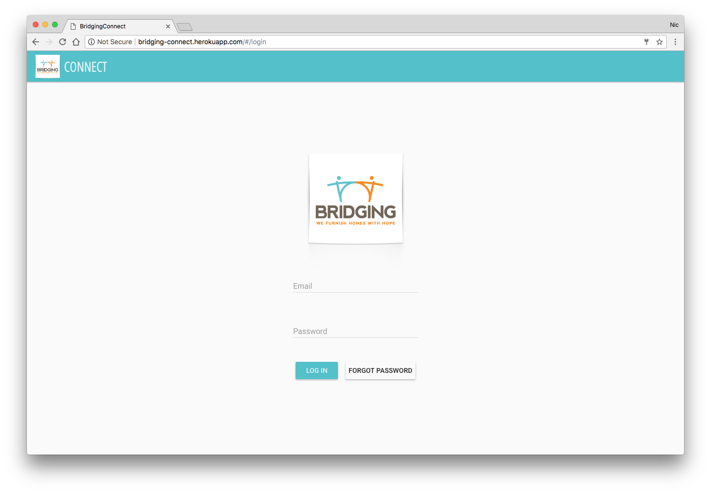
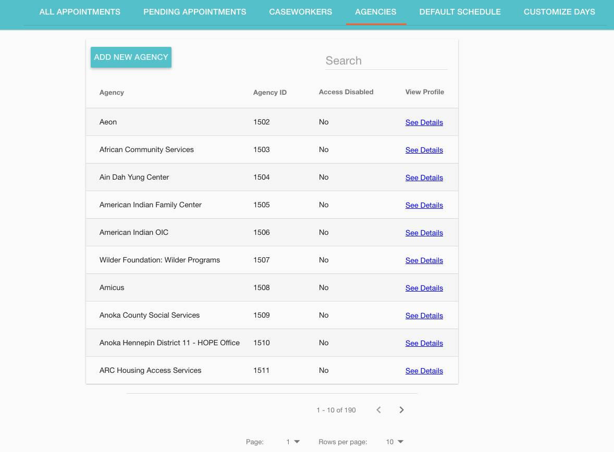
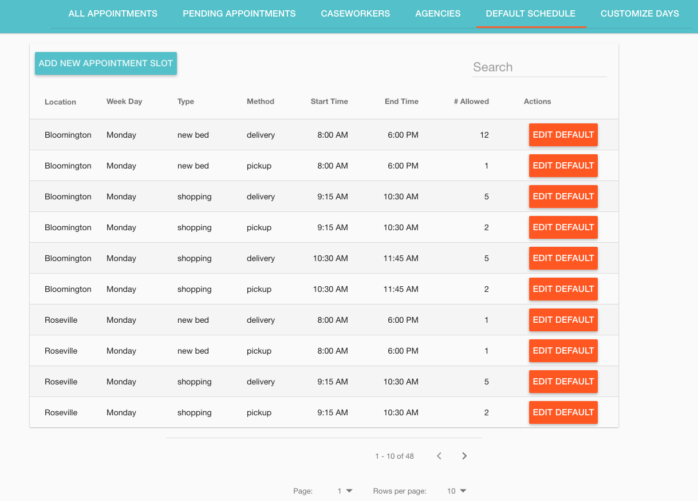
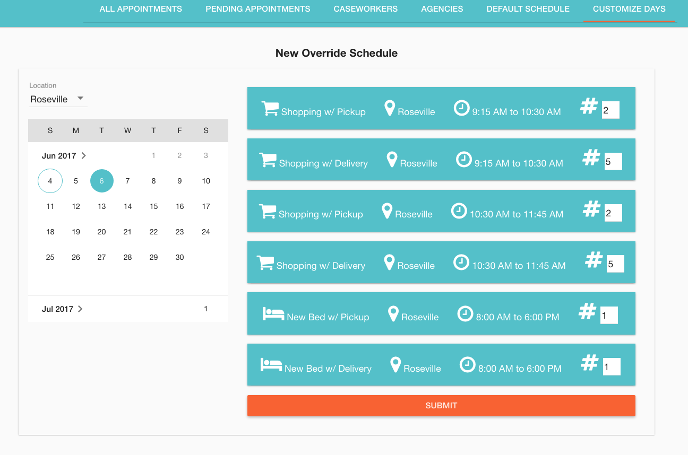
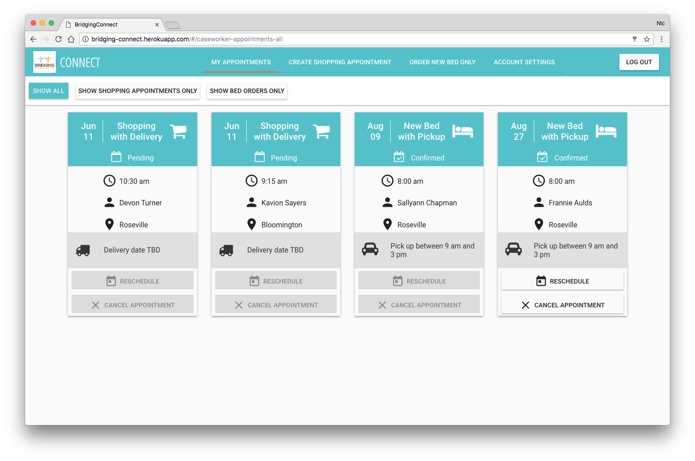

# [Bridging MN Appointment Scheduling Application](https://bridging-connect.herokuapp.com)

Bridging Connect is a custom-built appointment management application for Bridging, a nonprofit furniture bank in the Twin Cities metro area. Bridging makes 4500 appointments every year with individuals in need of furniture and basic household goods. The appointments are made for these individuals by social service caseworkers, over 1600 of whom are currently registered in Bridging’s system.

Bridging Connect is built to smoothly facilitate the scheduling of shopping appointments, pickups and deliveries at Bridging’s Bloomington and Roseville locations. It includes an interface for caseworkers to schedule appointments for their clients, as well as an administrator interface for managing user accounts and appointment availability.

## Application Features

### Administrator Login



### 1.1.0 View all appointments

### 1.1.1 Search based on any parameters the appointment

### 1.1.2 View Details of each appointment

### 1.1.3 Edit Appointment or Client Information

### 1.1.4 Confirm, Cancel or Deny Appointment

### 1.2.0 View all pending appointments

### 1.2.1 Search based on any parameters the appointment

### 1.2.2 View Details of each appointment

### 1.2.3 Edit Appointment or Client Information

### 1.2.4 Confirm, Cancel or Deny Appointment

### 1.3.0 View all caseworkers

### 1.3.1 Search Caseworkers by any parameter listed in the table

### 1.3.2 Add a new caseworker

### 1.3.3 Edit or Delete caseworker

### 1.4.0 View all agencies



### 1.4.1 Search Agency by any parameter listed in the table

### 1.4.2 Add a new agency

### 1.4.3 Edit or Delete agency

### 1.5.0 View Default Schedule



### 1.5.1 Add new Default Slot

### 1.5.2 Edit Default Slot

### 1.6.0 View Schedule Overrides

### 1.6.1 Add New Override by Date



### Caseworker Login


### 2.1.0 View All Appointments



### 2.1.1 Cancel or Reschedule Appointments

### 2.1.2 Edit Client Referral Form

### 2.2.0 Create New Appointment for furniture

### 2.2.1 Caseworker selects delivery or pick up

### 2.2.2 Delivery option directs you to warehouse location based on Zipcode

### 2.2.3 Caseworker selects preferred appointment Date and time

### 2.2.4 Caseworker completes Client Referral Form

### 2.3.0 Create New Appointment for New Bed Only

### 2.3.1 Caseworker selects delivery or pick up

### 2.3.2 Delivery option directs you to warehouse location based on Zipcode

### 2.3.3 Caseworker selects preferred appointment Date and time

### 2.3.4 Caseworker completes Client Referral Form

## Getting Started

These instructions will get you a copy of the project up and running on your local machine for development and testing purposes. See deployment for notes on how to deploy the project on a live system.

### Prerequisites

You will need to have the following software installed:


* [Node.js](https://nodejs.org/en/)

* [PostgreSql](https://launchschool.com/blog/how-to-install-postgresql-on-a-mac)

* [Postico](https://eggerapps.at/postico/)


### Installing

Steps to get the development environment running.

1. Clone the repository to your local machine.

    ```
    git clone https://github.com/BridgingMN/bridging-connect.git
    ```

2. Install all dependencies.

    ```
    npm install
    ```

3. Install Postgres.

    ```
    brew install postgres
    ```

3. Ensure PostgreSql is running.

    ```
    brew services start postgresql
    ```
4. Set up local Postgres database.

* Use Postico or a similar PostgreSQL client to create a new database.
* Copy all code from the database.sql file in the root directory of this project.
* Paste code into SQL query interface in Postico. Run code.

5. Set up account with Mailgun (or another email automation service; if you use a different service, you will need to change the configuration of the Nodemailer transport in server/modules/mail.js). You will need the Mailgun address and password for the next step.

6. Create .env file for storing local versions of environmental variables.

* In the root directory, create a file with the name `.env`
* Add .env to .gitignore
* Add the Mailgun address and password, a secret (used by the Passport authentication service, can be any string), and the name of your Postgres database using the format below:

    ```
    NODEMAILER_ADDRESS=postmaster@sandbox6687772a7dd61dc9b819ecb3f9.mailgun.org
    NODEMAILER_PW=5ac5a760ffdd90347222ff2eb36ef989
    SECRET=6105ab0b6039d9aecf7a72fede2f33ac
    DATABASE_NAME=bridgingConnect
    ```

7. Start Grunt.

    ```
    grunt
    ```

8. Spin up the Server.

    ```
    npm start
    ```

9. Open in the browser.

    ```
    localhost:5000
    ```

10. Create initial admin user.

* Replace `YOUR_FIRST_NAME`, `YOUR_LAST_NAME`, and `YOUR_EMAIL` in the SQL code below with your information, then run the code in your database.

    ```
    INSERT INTO "users" ("agency_id", "first", "last", "email", "user_type_id") VALUES (1, 'YOUR_FIRST_NAME', 'YOUR_LAST_NAME', 'YOUR_EMAIL', 1);
    ```

* Open the site in the browser at `localhost:5000`. Click "Forgot Password". 
* Enter the email address you entered into the database and click "Send Reset Code". You should receive an automated email link to follow that will enable you to create a password to use along with your email address to log into the site.

* NOTE: For initial setup/demo purposes only, if the automated email isn't working, you can use the following workaround to manually create your own password reset link. After completing the above steps (which will generate a temporary password reset token associated with your user info), retrieve the token by running the following code in your database (replacing `YOUR_EMAIL` with the email address you provided earlier):

    ```
    SELECT "token" FROM "users" WHERE "email" = 'YOUR_EMAIL';
    ```

* Copy the returned token and paste it into the following link (replacing `TOKEN` with your token and `YOUR_EMAIL` with your email address):

    ```
    localhost:5000/#/updatepassword/TOKEN/YOUR_EMAIL/updatedPassword
    ```

* Enter a password and click "Update Password". If you return to the main login page, you should now be able to log in using your email address and the password you created.

11. [Optional] The REST API used in this app has been documented using an inline documentation tool called apiDoc. Automatically generated files to produce easily readable & navigable API documentation are stored in a directory called `apidoc`. To view the documentation, find the `index.html` file in the `apidoc` folder and open it in your browser.

12. [Optional] For testing/demo purposes, routes are currently built into the app for easily adding dummy appointment & caseworker data to the database. Note: You must be logged into the app as an admin in order to use these routes.

    * You can add dummy appointments to the database by logging into the app as a user with admin privileges and then entering the following URL (with `NUMBER_OF_DUMMY_ENTRIES` replaced by an actual number):
        ```
        http://localhost:5000/installDummies/appointments/NUMBER_OF_DUMMY_ENTRIES
        ```
    * You can add dummy caseworkers to the database by logging as a user with admin privileges and entering the following URL (with `NUMBER_OF_DUMMY_ENTRIES` replaced by an actual number):
        ```
        http://localhost:5000/installDummies/caseworkers/NUMBER_OF_DUMMY_ENTRIES
        ```

## Built With

* PostgreSql
* Express.js
* AngularJS
* Node.js
* Grunt
* HTML5
* CSS3
* AngularJS Material
* Heroku
* Heroku Postgres
* Passport.js
* Nodemailer
* Moment.js

## Documentation

[Scope Document](https://docs.google.com/document/d/1v6IdjE2lDHTlds3XIoozz-e2vWwTgf6rsJKuMvmSaC8/edit?usp=sharing)

## Deployment

* To test the application live, one possible method is to use mLab to host the database and Heroku to deploy the app.
* You will need to include the following config variables in your Heroku settings: 
    * DATABASE_HOST
    * DATABASE_NAME
    * DATABASE_PW
    * DATABASE_URI
    * DATABASE_URL
    * DATABASE_USER
    * HOSTING_URL
    * NODEMAILER_ADDRESS
    * NODEMAILER_PW
    * SECRET

## Authors

* [**Anna Springfield**](https://github.com/aespringfield)
* [**Betsy Rowley**](https://github.com/BetsyRowley)
* [**Dan Zera**](https://github.com/danzera)
* [**Nic Wilson**](https://github.com/nicolaslwilson)


## Acknowledgments

* Thanks to Bridging for the inspirational work they do helping furnish homes for thousands of people in need.
* Thanks to Prime Digital Acadedmy Instructors Scott Bromander, Chris Black, and Luke Schlangen for support during this project.
